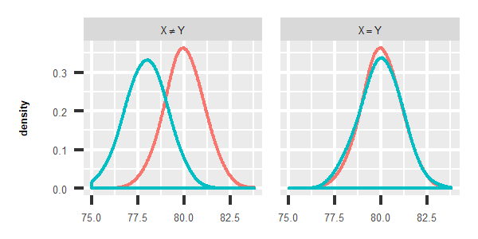
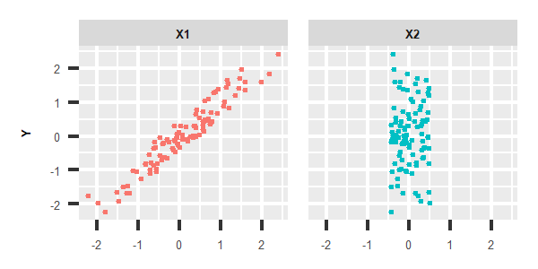
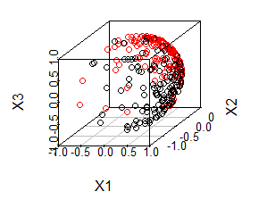

```{r, echo=FALSE, message=FALSE, warning=FALSE}
knitr::opts_chunk$set(comment = "#", warning = FALSE, eval = TRUE, message = FALSE)
set.seed(1)
library(Ball)
```


# Quick Start       
The fundamental problems for data mining and statistical analysis are:

1. Whether distributions of two samples are distinct?

2. Whether two random variables are dependent?


Two-sample test, which is designed to solve the first problem, is very important in medicine, psychology, biology and so on. For instance, we want to know whether lifespan of male and female is different. Thus, we collect lifetime data, and try to figure out whether ages in two samples are identically distributed. As the following images shown, if distribution of life span in two groups look like the left one, we conclude that lifetime are not identically distributed. But for the right one, it indicates that they are most likely to be identically distributed.



Test of independence, which is designed to solve the other problem, is also very essential. As the following images shown, there is a strong linear relation with Y and X1, while X2 seems to have nothing to do with Y. So X1 should be taken into account and added in to the regression model for Y, or should be studied carefully in order to confirm the correlation mechanism with Y.         
            


**Ball** package provides solution for independence test, two-sample test or even K-sample test. Moreover, a generic non-parametric sure independence screening procedure also implemented to deal with ultra high dimensional data.        

The three core functions are:       

- **bd.test**: examine whether $K(K \geq 2)$ univariate or multivariate distributions are identical.          

- **bcov.test**: test whether univariate or multivariate variables are related to each other.        

- **bcorsis**: carry out sure independence screening procedure to pick out the variables potentially related to response.       

### Installation        
#### CRAN version         
To install the Ball R package from CRAN, just run:        
```{r,eval=FALSE}
install.packages("Ball")
```

#### Github version       
To install the development version from GitHub, run:      
```{r, eval=FALSE}
library(devtools)
install_github("Mamba413/Ball", build_vignettes = TRUE)
```

*Windows* user will need to install [Rtools](https://cran.r-project.org/bin/windows/Rtools/) first.       
```{r, echo=FALSE}
library(Ball)
```

### Quick Start: Univariate Two-sample Test           

In this example, we generate two normal random variables with different location parameter:
$$X \sim N(0,1), Y \sim N(1, 1)$$ 
<!-- In the mean time, we use the non-parametric kernel density estimation to plot the kernel density of two distribution: -->

```{r}
x <- rnorm(50)
y <- rnorm(50, mean = 1)
# plot(density(x), xlim = c(-5, 5))
# lines(density(y), col = 'red')
```
      
<!--  -->

We use **bd.test** to perform the two-sample test to determine whether two samples come from 
the same distribution.       

```{r}
## TOFIX
# bd.test(x = x, y = y)
```
          
The result of **bd.test** is that *p*-value < 0.05, which means to reject the null hypothesis, and conclude that two samples are come from different distribution. Consequently, the hypothesis test result is concordant to data generation mechanism.

### Quick Start: Multivariate Two-sample Test       

In this example, we will demonstrate how to perform a test of whether two multivariate distributions are identical. We generate two random samples of size 50, which are sampled from two different multivariate normal distributions:
$$X \sim N(\mu_{X},I_{2 \times 2}), Y \sim N(\mu_{Y}, I_{2 \times 2})$$
$$\mu_{X} = (0,0), \mu_{Y} = (1,1)$$
<!-- Then we will show the difference between these two samples in the way of kernel density estimation: -->
          
```{r}
x <- matrix(rnorm(100), nrow = 50, ncol = 2)
y <- matrix(rnorm(100, mean = 3), nrow = 50, ncol = 2)
```
          
<!--  -->

We use **bd.test** to test whether two multivariate random samples are identically distributed.       
        
```{r}
bd.test(x = x, y = y)
```
        
The result of **bd.test** is that *p*-value < 0.05, so we conclude that two samples are not identically distributed.
        
### Quick Start: Univariate Test of Independence      
In this example, we will use the "W-shape" data from [WIKI](https://en.wikipedia.org/wiki/Correlation_and_dependence) 
to demonstrate how to perform univariate test of independence with  **bcov.test** .    

We generate a dataset containing 50 samples. 

```{r}
# generate random perturbation:
noise <- runif(50, min = -0.3, max = 0.3)
x <- runif(50, 0, 4*pi)
y <- cos(x) + noise
# plot(x, y)
```

        
<!-- From the plot we can see that $X$ has complex non-linear relation with Y. -->
Obviously, $X$ is related to $Y$, but the relationship is non-linear.
We use **bcov.test** to perform the test of independence between $X$ and $Y$.
          
```{r}
bcov.test(x = x, y = y)
```
 
The result of **bcov.test** is that *p*-value < 0.05, so we conclude that $X$ and $Y$ are not independent, which means there is some kind of correlation between X and Y.
        
### Quick Start: Multivariate Test of Independence      
For multivariate independence test, we will demonstrate the usage of **bcov.test**
with the following example: $X=(x_{1}, x_{2})$ come from the bivariate normal distribution.
The relation between $Y$ and $X$ is:      
$$Y=2\sin(x_{1} + x_{2})+ \epsilon, \quad \epsilon \sim U(-0.1, 0.1)$$

```{r}
x <- matrix(runif(50 * 2, -pi, pi), nrow = 50, ncol = 2)
noise <- runif(50, min = -0.1, max = 0.1)
y <- 2 * sin(x[,1] + x[,2]) + noise
```
        
<!-- The following image shows the distribution of the data: -->

<!--  -->
        
We use **bcov.test** to perform multivariate independence test:
        
```{r}
bcov.test(x = x, y = y, weight = "prob")
```
          
The result of **bcov.test** is that *p*-value < 0.05, so we conclude that multivariate random variable $X$ and $Y$ are associated.
          
<!-- *** -->

<!-- # Introduction           -->

<!-- ### Ball Divergence        -->

<!-- We want to determine whether distributions of two samples $\mathcal{X} = \lbrace x_{1},...,x_{n} \rbrace$ and $\mathcal{Y} = \lbrace y_{1},...,y_{m} \rbrace$ are distinct.         -->
<!-- Intuitively, if $\mathcal{X}$ and $\mathcal{Y}$ come from identical distribution and we use any two points $x_{i}, x_{j} \in \mathcal{X}$ to construct a ball, then the ratio that elements of $\mathcal{X}$ and $\mathcal{Y}$ in the ball will be close to each other, which means: -->
<!-- $$A^{X}_{ij}  \approx A^{Y}_{ij}$$ -->
<!-- $$A^{X}_{ij} = \frac{1}{n}\sum_{u=1}^{n}{I(x_{u} \in \bar{B}(x_{i}, \rho(x_{i}, x_{j}))}$$ -->
<!-- $$A^{Y}_{ij} = \frac{1}{m}\sum_{v=1}^{m}{I(y_{v} \in \bar{B}(x_{i}, \rho(x_{i}, x_{j}))}$$ -->
<!-- where $\bar{B}(x_{i}, \rho(x_{i}, x_{j}))$ is a closed ball with center $x_{i}$, -->
<!-- and radius $\rho(x_{i}, x_{j})$ and $I$ is indicator function. -->

<!--  -->

<!-- In a similar way, for any two points $y_{i}, y_{j} \in \mathcal{Y}$, -->
<!-- they should also have the property: -->
<!-- $$C^{X}_{ij} \approx C^{Y}_{ij}$$ -->
<!-- $$C^{X}_{ij} = \frac{1}{n}\sum_{u=1}^{n}{I(x_{u} \in \bar{B}(y_{i}, \rho(y_{i}, y_{j}))}$$ -->
<!-- $$C^{Y}_{ij}=\frac{1}{m}\sum_{v=1}^{m}{I(y_{v} \in \bar{B}(y_{i}, \rho(y_{i}, y_{j}))}$$ -->
<!-- We combine the difference between $A^{X}_{ij}, A^{Y}_{ij}$ and the difference between -->
<!-- $C^{X}_{ij}, C^{Y}_{ij}$ together in the following way: -->
<!-- $$D_{n,m} = A_{n,m} + C_{n,m}$$  -->
<!-- where: -->
<!-- $$A_{n,m} = \frac{1}{n^{2}}\sum_{i,j=1}^{n}{(A_{ij}^{X}-A_{ij}^{Y})^{2}}$$ $$C_{n,m}=\frac{1}{m^{2}}\sum_{k,l=1}^{m}{(C_{kl}^{X}-C_{kl}^{Y})^{2}}$$ -->
<!-- $D_{n,m}$ is the sample version of Ball Divergence, defined by Pan et.al(2017). Techinical proofs provided by Pan et.al ensure $D_{n, m}$ converges to $D(\mu, \nu)$ when $n, m$ increase to infinity so long as:  -->
<!-- $$\frac{n}{m+n} \to \tau, \tau \in [0, 1].$$       -->

<!-- [Pan et al. (2017)](https://www.google.com/url?sa=t&rct=j&q=&esrc=s&source=web&cd=1&ved=0ahUKEwjBvbb7gdTWAhUEoZQKHYvODxkQFggmMAA&url=https%3A%2F%2Fwww.e-publications.org%2Fims%2Fsubmission%2FAOS%2Fuser%2FsubmissionFile%2F24632%3Fconfirm%3D9219c1d0&usg=AOvVaw3I3Tad92DvETqhJEnJ7FyN) had proven that sample version of ball divergence $D(\mu, \nu) \geq 0$ where the equality holds if and only if $\mu=\nu$ where $\mu, \nu$ are induced measure corresponding to distribution of sample $\mathcal{X}$ and $\mathcal{Y}$. Theory and numerical result guarantee Two-Sample Test based on ball divergence have following advantages:         -->

<!-- - It is applicable to the univariate or multivariate data in Banach Space.             -->
<!-- - Robust to heavy-tail data or outliers.        -->

<!-- - Cope well for imbalanced data.        -->

<!-- - Works fine for most problems without tuning a variety of parameters.       -->


<!-- ### Ball Covariance                  -->
<!-- Investigate the dependence between variables is a fundamental step in statistical inference and data mining. Suppose, We are given pairs of independent observations $\{(x_1, y_1),\ldots,(x_n,y_n)\}$, where $x_i$ and $y_i$  can be of any dimension and the dimensionality of $x_i$ and $y_i$ need not be the same. Let $X = (x_1,\ldots,x_n)$ be the $X$ vector, and $Y=(y_1,\ldots,y_n)$ the  -->
<!-- $Y$ vector and we want to determine whether $X$ and $Y$ are dependent. -->
<!-- <!-- , which means whether $F_{XY}=F_{X}F_{Y}$ is valid or not. Where $F_{XY}$ is the joint distribution function of $X, Y$. -->
<!-- To achieve the goal, we come up with **Ball Covariance** ($\mathbf{BCor}_{\omega, n}^{2}$), a generic measure of dependence in banach space. Moreover, the $\mathbf{BCor}_{\omega, n}^{2}$ based independence test utilized permutation technique to calculate *p*-value is also developed. Sample version of $\mathbf{BCor}_{\omega, n}^{2}$ is defined as follow:          -->
<!-- $$\mathbf{BCor}_{\omega, n}^{2}(X, Y)=\frac{1}{n^{2}}\sum_{i,j=1}^{n}{(\Delta_{ij,n}^{X,Y}-\Delta_{ij,n}^{X}\Delta_{ij,n}^{Y})^{2}}\hat{\omega}_1(X_i,X_j)\hat{\omega}_2(Y_i,Y_j)$$ -->
<!-- where: -->
<!-- $$ \Delta_{ij,n}^{X,Y}=\frac{1}{n}\sum_{k=1}^{n}{\delta_{ij,k}^{X} \delta_{ij,k}^{Y}}$$ -->

<!-- $$\Delta_{ij,n}^{X}=\frac{1}{n}\sum_{k=1}^{n}{\delta_{ij,k}^{X}},  -->
<!-- \Delta_{ij,n}^{Y}=\frac{1}{n}\sum_{k=1}^{n}{\delta_{ij,k}^{Y}} $$ -->

<!-- $$ \delta_{ij,k}^{X} = I(x_{k} \in \bar{B}(x_{i}, \rho(x_{i}, x_{j})))$$ -->

<!-- $$\delta_{ij,k}^{Y} = I(y_{k} \in \bar{B}(y_{i}, \rho(y_{i}, y_{j})))$$ -->

<!-- Generally, we define $\hat{\omega}_1(X_i,X_j) = \hat{\omega}_2(Y_i,Y_j) = 1$, and simplify the notation $\mathbf{BCor}^{2}_{\omega, n}$ as $\mathbf{BCor}^{2}_{n}$ -->

<!--  -->

<!-- As the image above shown, the joint probability that $X, Y$ are both in the ball are intuitively closed to the product of marginal probability that $X$ and $Y$ are in the ball when $X$ and $Y$ are independent,  i.e.: -->
<!-- $$\Delta_{ij,n}^{X,Y} \approx \Delta_{ij,n}^{X}\Delta_{ij,n}^{Y}$$ -->

<!-- Consequently, if $\mathbf{BCor}_{\omega, n}^{2}$ is significantly larger than 0, then it indicates that $X$ and $Y$ are not independent. -->

<!-- As Pan's paper proved theoretically and demonstrated numerically, the independence test based on $\mathbf{BCor}_{\omega, n}^{2}$ has several advantages: -->

<!-- - It is applicable to the univariate and multivariate data in banach space.       -->
<!-- - Robust to heavy-tail data or outliers         -->

<!-- - Works fine for most problems without tuning a variety of parameters.          -->

<!-- *** -->

# Advance Features        
The features below have been implemented to help you analyse diverse and complicated real data.        

## Non-Hilbert Space Data        
During the scientific research, we always have to deal with Non-Hilbert space data.
However, the traditional statistical inference methods usually depend on some assumptions,
which are not able to perform statistical inference on this kind of data directly.
Whereas ball divergence doesn't depend on the assumptions needed in traditional statistical inference
method, and it's able to perform two-sample test for data from Non-Hilbert space.
We will demonstrate how to use  **Ball** package to perform statistical inference for data from Non-Hilbert space with three examples:
        
#### Example 1: Simulated von Mises-Fisher distribution data        
```{r}
# load data:
data("bdvmf")
```
 
The distribution of the data is shown in the following image:                 
```{r, eval=FALSE, echo=FALSE}
library(scatterplot3d)
scatterplot3d(bdvmf[["x"]], color = bdvmf[["group"]], 
              xlab = "X1", ylab = "X2", zlab = "X3")
```


In the image, the black dots ($X$) and red dots ($Y$) respectively represent two group of simulated data with different distributions. The distributions are denoted by:
$$X \sim M(\mu_{X}, \kappa), Y \sim M(\mu_{Y}, \kappa)$$
Where $M$ denotes 
[von Mises-Fisher distribution](https://en.wikipedia.org/wiki/Von_Mises%E2%80%93Fisher_distribution),
$\mu_{X} = (1, 0, 0), \mu_{Y} = (1, 1, 1)$ are the orientation parameter of von Mises-Fisher
distribution, $\kappa = 3$ denotes aggregation parameter.

We can tell from the image that, red dots and black dots are not identically distributed. However, it is a tough task for the traditional statistical method to distinguish distribution because it is not a conventional data in Hilbert space. 
Fortunately, since the computation for sample version of ball divergence (ball covariance) only involves calculate distance matrix and counting the number of samples located in a ball, we can obtain empirical ball divergence so long as we can define the distance metric between observations. Therefore, ball divergence still work for this example.

We apply ball divergence to this data by carrying out the following step. First, we calculate the geodesic distance matrix of the data, which have been implemented in function \code{nhdist}. Later, we pass the distance matrix to arguments \code{x} and let \code{distance = TRUE}, \code{num.permutations = 99}, and \code{size = c(150, 150)}. 
The detailed solution is demonstrated below:
          
```{r}
# calculate geodesic distance between samples:
dx <- nhdist(bdvmf[["x"]], method = "geodesic")
# sample sizes in each group: 150, 150
# Two-Sample Test based on BD :
bd.test(x = dx, size = c(150, 150), num.permutations = 99, distance = TRUE)
```

In this example, we firstly calculate the geodesic distance matrix using **nhdist** function in *Ball* package. Then, pass *dx* to arguments *x* and 
set *distance = TRUE* to indicate that the *x* parameter is a distance matrix.
Meanwhile, we set the size of each sample *size = c(150, 150)* and set the replication times *num.permutations = 99*.
The result is that *p*-value < 0.05, which means that red dots and black dots are not identically distributed.        
    
#### Example 2: Macaques Data       
Based on Macaques data provided by dryden, scientists want to figure out whether there are differences in the shape of skull between Macaques of different genders.
In a similar way, we can calculate the distance matrix of the data and transform this problem into two-sample test that can be solved by BD.
Riemann shape distance is always used to describe the distance between shape data.
By setting *method = "riemann"* in the **nhdist** function, we are able to
calculate the riemann shape distance between shape data.
The detailed procedure is demonstrated below:

```{r}
# load data:
data("macaques")
# number of femala and male Macaca fascicularis:
# table(macaques[["group"]])  # f: 9; m: 9
# calculate Riemannian shape distance matrix:
dx <- nhdist(macaques[["x"]], method = "riemann")
# hypothesis test with BD:
bd.test(x = dx, num.permutations = 99, size = c(9, 9), distance = TRUE)
```
              
*p*-value is under 0.05, which means the skull shape differs between male macaques and female macaques.
        
#### Example 3: ArcticLake Data        
**bcov.test** is related to calculating the
distance between samples of two multivariate random variables.
Therefore, we can examine independence assumption by employing **bcov.test** to non-Hilbert space real data so long as we obtain the distance matrix of the samples.        

We take a data in the Book, **The Statistical Analysis of Compositional Data**, as an example to demonstrate how to use **bcov.test** to determine the dependence of non-Hilbert space data. Scientists collect Sand, silt and clay compositions of 39 sediment samples of different water depth in an Arctic lake. They want to figure out whether the compositions of sediment samples of different water depth are identical or not.
To achieve the goal, we use **bcov.test** to perform the test of independence. The detailed procedure is demonstrated below:

```{r}
data("ArcticLake")
# Distance matrix between y:
dy <- nhdist(ArcticLake[["x"]], method = "compositional")
# Distance matrix between x:
dx <- dist(ArcticLake[["depth"]])
# hypothesis test with BCov:
bcov.test(x = dx, y = dy, num.permutations = 99, distance = TRUE)
```

We first calculate the distance matrix *dy* and *dx*. Then, we pass *dx*  to arguments *x*, *dy* to arguments *y*, and set the replication times *num.permutations = 99*, *distance = TRUE*  to indicate that the *x* and *y* parameters are distance matrices.       
The result shows that *p*-value is less than 0.05, an usual significance level, so we conclude that the compositions of sediment is associated with the water depth.       

In the example above, we use the square root transformed data to calculate 
the geodesic distance as a measurement of the difference between different
compositions of sediment samples (*Dy*). Meanwhile, we use euclidean distance to measure the difference of different water depth (*Dx*). For different data, we can use different measurements to cope with the 
different features in data.              


## K-Sample Test       
**bd.test** is also applicable for testing of multiple samples. 
We generate three random normal samples of size 50, which are sampled from the same normal distribution.
As an example, we use **bd.test** to test whether these samples are 
identically distributed.
```{r}
n <- 150
bd.test(rnorm(n), size = rep(50, 3))
```

As the result shown, *p*-value>0.05, which means we can't reject the null hypothesis.                 
We can also utilize **bd.test** to deal with $K$-Sample problem in non-Hilbert space following the aforementioned procedure. At the same time, remember to assign size vector to parameter *size* arguments and set *distance = TRUE*.

<!-- Independent test based on ball correlation, which is a normalized coefficient of ball covariance also available now. Ball correlation statistic will be used when setting  -->
<!-- *type = "Bcor"* in **bcov.test**.          -->


## Weighted Ball Covariance Test        
<!-- Moreover, we can extend defintion of $\hat{\omega}_1(X_i,X_j), \hat{\omega}_2(Y_i,Y_j)$. For example, we let: -->
<!-- $$\hat{\omega}_1(X_i,X_j) = \frac{1}{\rho(X_{i}, X_{j})}, \hat{\omega}_2(Y_i,Y_j) = \frac{1}{\rho(Y_{i}, Y_{j})}$$ -->
<!-- and calculate the weighted ball covariance:         -->
<!-- $$\mathbf{BCov}^2_{\omega,n}(\mathbf{X},\mathbf{Y}):=\frac{1}{n^2}\sum_{i,j=1}^{n}{(\Delta_{ij,n}^{X,Y}-\Delta_{ij,n}^{X}\Delta_{ij,n}^{Y})^2\hat{\omega}_1(X_i,X_j)\hat{\omega}_2(Y_i,Y_j)}$$ -->

Pan et. al(2017) show that the weighted ball covariance based independence test is statistical consistent against all dependence alternatives without any moment conditions and some times superior to standard version of ball covariance.          

We have been implemented weighted ball covariance test in **Ball** package and we can employ it to data analysis by just setting *weight = TRUE* in **bcov.test**. Take *ArcticLake* data as example:
        
```{r}
data("ArcticLake")
Dy <- nhdist(ArcticLake[["x"]], method = "compositional")
Dx <- dist(ArcticLake[["depth"]])
# hypothesis test with weighted BCov:
bcov.test(x = Dx, y = Dy, num.permutations = 99, 
          distance = TRUE, weight = "constant")
```

## Ball Covariance Mutual Independence Test       
Apart from the relationships between two random variables, another important dependence concept for a set of variables is mutual (or joint) independence, which says that any two disjoint subsets of variables are independent from each other. For instance, we know to investigate whether air temperature, soil temperature, humidity, wind and evaporation are correlated.

It is natural to extend ball covariance to measure mutual independence between $K$ random variables. 
<!-- as follows: -->
<!-- $$\mathbf{BCor}_{\omega, n}^{2}(R_{1}, ..., R_{K})=\frac{1}{n^{2}}\sum_{i,j=1}^{n}{(\Delta_{ij,n}^{R_{1}, ..., R_{K}}-\prod_{k=1}^{K}\Delta_{ij,n}^{R_{k}})^{2}\prod_{k=1}^{K}{\hat{\omega}_{k}(R_{ki},R_{kj})}}$$ -->
<!-- where $R_{k}, k=1,...K$ indicate random variables and $R_{ki}, i=1,...,n$ denote $n$ random samples of $R_{k}$.  -->
More importantly, Mutual independence test based on ball covariance have been implemented in  **Ball** package. We give two simply example in the following to demonstrate its usage.

The first example, $X, \epsilon_{1}, \epsilon_{2}$ are independent from the standard normal distribution $N(0,1)$, and
$$Y = \max(X, 0) + \epsilon_{1}, \; Z = \min(X, 0) + \epsilon_{2}$$

```{r}
x <- rnorm(50)
y <- (x > 0) * x + rnorm(50)
z <- (x <= 0) * x + rnorm(50)
example1 <- list(x, y, z)
```

The Second example, $W, X, Y, Z$ are connected by a latent random variable $H \sim N(0,1)$, and
$$W = H^{2}; X = |H|, Y = min(H, 0)$$
$$Z = (Z_{1}, Z_{2}), Z_{1}=I(H<0.5)H, Z_{2}=I(H>-0.5)H$$

```{r}
h <- rnorm(50)
w <- (h)^2
x <- abs(h)
y <- h * (h < 0)
z1 <- h * (h < 0.5)
z2 <- h * (h > -0.5)
z <- cbind(z1, z2)
example2 <- list(w, x, y, z)
```

We bind these data to list *example1* and *example2* and pass them to arguments *x* in **bcov.test** to carry out ball covariance mutual independence test.

```{r}
bcov.test(x = example1, num.permutations = 199)
bcov.test(x = example2, num.permutations = 199)
```

The hypothesis test result for two examples show that *p*-value < 0.05, coinciding with the simulation setting.         

## Ball Correlation Based Sure Independence Screening         

Recent technological advances have made it possible to collect ultra high-dimensional data. 
A common feature of these data is that the number of variables $p$ is generally much larger than sample sizes $n$. 
For instance, the number of gene expression profiles is in the order of 
tens of thousands while the number of patient samples is in the order of tens or hundreds. 
However, traditional variable selection algorithms such as LASSO, SCAD may not 
perform well due to the statistical inaccuracy, and algorithmic instability.
        
A new framework, sure independence screening (SIS), was proposed to tackle the challenges above. 
SIS tries to filtering out the features that have marginal
correlation with the response, hence effectively reducing the dimensionality $p$ to a moderate scale so 
that performing statistical algorithm is feasible.

BCor-SIS, a generic non-parametric sure independence screening procedure based on ball 
correlation, is able to pick out explanatory variables related to response. The linear, non-linear or linear interaction effect relationship can be captured by BCor-SIS even though data is heavy tail or existing outliers. More importantly, BCor-SIS is able to retain all of the important features in
the model with probability tending to 1 under mild conditions.


### BCor-SIS: Quick Start Example        

In this example, we will utilize **bcorsis** function to carry out BCor-SIS procedure. 
We generate 150 high dimensional instances with 3000 independent standard gaussian explanatory variables $X$ and univariate response variable $Y$. The relation between $Y$ and $X$ is:      
$$Y=3 X_{1} + 5 X_{3}^{2} + \epsilon, \quad \epsilon \sim N(0, 1)$$

```{r}
set.seed(1)
n <- 150
p <- 3000
x <- matrix(rnorm(n * p), nrow = n)
noise <- rnorm(n)
y <- 3*x[, 1] + 5*(x[, 3])^2 + noise
```
      
We perform BCor-SIS procedure and display the top 5 variables index selected by BCor-SIS.               

```{r}
## TOFIX
# res <- bcorsis(y = y, x = x)
# head(res[[1]], n = 5)
```
          
The **bcorsis** result shows that the first and the third variable are the two most 
important variables in 3000 explanatory variables which is consistent to simulation settings.


### Extension of BCor-SIS: A Censored Survival Data                
Survival analysis is a commonly used method for the analysis of censored data such as
biological death and mechanical failure, which is usually subject to censoring. 
The main goal of survival analysis is to study the dependence of the survival 
time $T$ on covariate variables $X, X \in R^{p}$.

With the remarkable development of modern technology, a huge amount
of covariate information such as microarray and SNP data are collected. 
Consequently, SIS procedure designed for censored survival data is in need. 
Pan et al(2017) proposed a extend BCor-SIS procedure which is able to selected 
the significant variables for censored data.
        
We implement BCor-SIS procedure for survival data in **Ball** package and use a publicly lung cancer genomic data from the Chemores Cohort Study to demonstrate its usage. 
The data outcome was the "Disease-Free Survival Time". Patients were followed until the first relapse occurred or administrative censoring. In this genomic dataset, the expression levels of mRNA, miRNA as well as clinical variables from the 123 samples were included. Moreover, this dataset include 944 biological covariates and 1056 artificial standard gaussian variables which are independence with response. We employ extension of Bcor-SIS on this data to hunt for efficient covariates and demonstrate detailed procedure in the following.        

```{r}
## TOFIX
# result <- bcorsis(x = genlung[["covariate"]], 
#                   y = genlung[["survival"]], 
#                   d = "small", method = "survival")
# top_gene <- colnames(genlung[["covariate"]])[result[["ix"]]]
# head(top_gene, n = 1)
```
        
We first pass covariates and censored information to arugments *x* and *y*, and set the *method = "survival"* to indicate that the *y* should be considered as a survival status containing event time and censored status. BCor-SIS asserts that *hsa.miR.564*, corresponding to gene *MIR564*, is strongly relevant to disease-free survival status. The conclusion is highly coincident with the statement in other public literature.               


<!-- ### Reference -->