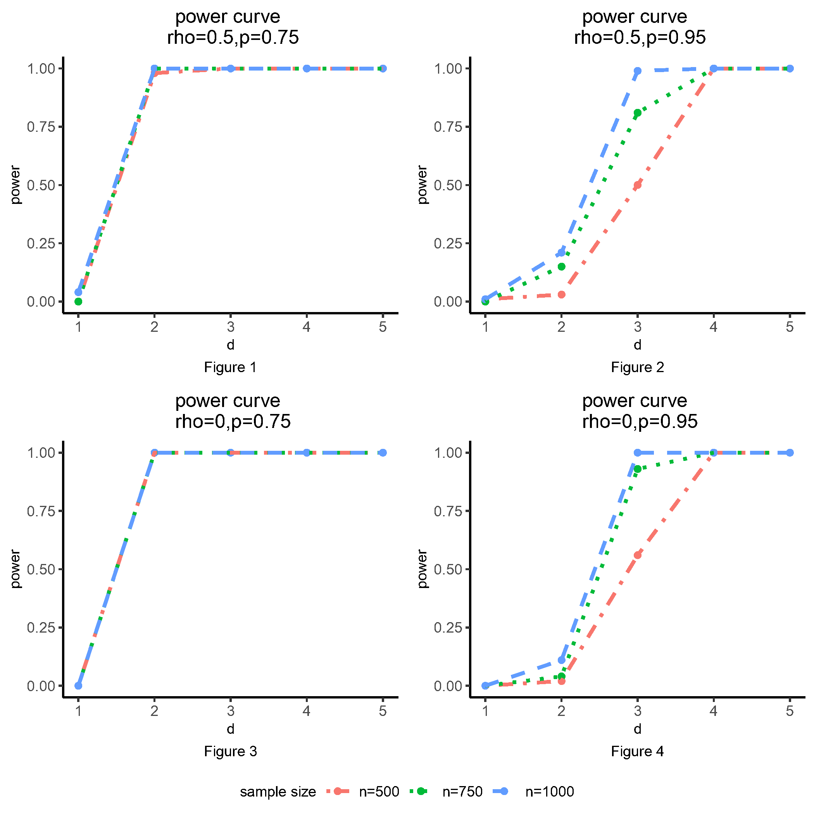

## Introduction        

The $K$-sample Ball Divergence (KBD) is a nonparametric method to test the differences between $K$ probability distributions. It is specially designed for metric-valued and imbalanced data, which is consistent with the characteristics of the GWAS data. It is computationally intensive for a large GWAS dataset because of the ultra-high dimensionality of the data. Therefore, a fast KBD Test for GWAS data implemented in function `bd.gwas.test` is developed and programmed to accelerate the computational speed. 

## Faster implementation: quick start       

We use a synthetic data to demonstrate the usage of `bd.gwas.test`. 
In this example, phenotype data are generated from three multivariate normal distributions with the same dimension but heterogeneous mean and covariance matrix. The three multivariate normal distributions are: (i). $N\sim(\mu, \Sigma^{(1)})$, (ii) $N \sim (\mu + 0.1 \times d, \Sigma^{(2)})$, and (iii) $N \sim (\mu + 0.1 \times d, \Sigma^{(3)})$. Here, the mean $\mu$ is set to $\textbf{0}$ and the covariance matrix covariance matrices follow the auto-regressive structure with some perturbations: $$\Sigma_{ij}^{(1)}=\rho^{|i-j|}, ~~ \Sigma^{(2)}_{ij}=(\rho-0.1 \times d)^{|i-j|}, ~~ \Sigma^{3}_{ij}=(\rho+0.1 \times d)^{|i-j|}.$$ 
The dimension of phenotype $k$ is fixed as 100. 

```{r, message=FALSE, warning=FALSE}
library(mvtnorm)

num <- 100
snp_num <- 200
k <- 100
rho <- 0.5
freq0 <- 0.75
d <- 3

set.seed(2021)

ar1 <- function (p, rho = 0.5) 
{
    Sigma <- matrix(0, p, p)
    for (i in 1:p) {
        for (j in 1:p) {
            Sigma[i, j] <- rho^(abs(i - j))
        }
    }
    return(Sigma)
}

mean0 <- rep(0, k)
mean1 <- rep(0.1 * d, k)
mean2 <- rep(-0.1 * d, k)

cov0 <- ar1(p = k, rho = rho)
cov1 <- ar1(p = k, rho = rho - 0.1 * d)
cov2 <- ar1(p = k, rho = rho + 0.1 * d)

p1 <- freq0 ^ 2
p2 <- 2 * freq0 * (1 - freq0)
n1 <- round(num * p1)
n2 <- round(num * p2)
n3 <- num - n1 - n2
x0 <- rmvnorm(n1, mean = mean0, sigma = cov0)
x1 <- rmvnorm(n2, mean = mean1, sigma = cov1)
x2 <- rmvnorm(n3, mean = mean2, sigma = cov2)
x <- rbind(x0, x1, x2)
head(x[, 1:6])
```

The number of SNPs is fixed as $200$ and the sample size is set to $100$. The sample sizes of the three groups follow the transmission ratio:
$$n_1:n_2:n_3 \approx p^2:2pq:q^2,(p+q=1,n_1+n_2+n_3=100).$$
Here, $p$ is set to be $0.75$, representing a scenario that close to the real data. 
$d$ is a user-specific positive integer, indicating the differences between the three probability distributions. Here, we use $d=3$, aiming to show that the SNP which matched with the distribution can be identified, even when the differences between distribution is small. 

```{r}
effect_snp <- c(rep(0, n1), rep(1, n2),
                rep(2, n3))
noise_snp <- sapply(2:snp_num, function(j) {
  sample(
    0:2,
    size = num,
    replace = TRUE,
    prob = c(p1, p2, 1 - p1 - p2)
  )
})
snp <- cbind(effect_snp, noise_snp)
head(snp[, 1:6])
```

Given the synthetic dataset `x` and `snp`, multiple KBD tests is conducted by:
```{r}
library(Ball)
res <- bd.gwas.test(x = x, snp = snp)
```

And we present the SNPs that is significant:
```{r}
str(res)
```

## Why `bd.gwas.test` is faster? 

Our faster implementation for multiple testing significantly speeds up the KBD test in two aspects.

### Two-step algorithm            

First, it uses a two-step algorithm for KBD. The algorithm first computes an empirical $p$-value for each SNP using a modest number of permutations which gives precise enough estimates of the $p$-values above a threshold. Then, the SNPs with first stage $p$-values being less than the threshold are moved to the second stage for a far greater number of permutations.

### Recycle permutation result        
Another key technique in `bd.test.gwas` is reusing the empirical KBD's distribution under the null hypothesis. This technique is particularly helpful for decreasing computational burden when the number of factors $p$ is very large and $K$ is a single digit. A typical case is the GWAS study, in which $p \approx 10^4$ or $10^5$ but $K = 3$. 

## Power evaluation               

According to the simulations:         

- the empirical type I errors of KBD are reasonably controlled around $10^{-5}$;        

- the power of KBD increases as either the sample size or the difference between means or covariance matrices increases. The empirical power is close to $1$ when the difference between distributions is large enough.         

Furthermore, correlated responses may slightly decrease the power of the test compared to the case of independent responses. Moreover, KBD performs better when the data are not extremely imbalanced and it maintains reasonable power for the imbalanced setting. 

Compared to other methods, KBD performs better in most of the scenarios, especially when the simulation setting is close to the real data. Moreover, KBD is more computationally efficient in identifying significant variants.

From Figures 1 and 3, we can notice that the power curves are similar after sample size of 500, when the minor allele frequency is not small. On the other hand, when the minor allele is rare, a larger sample size can lead to a higher power from Figures 2 and 4. The four figures show how sample size could affect the power of the KBD method, indicating that there is an inverse relationship between minor allele frequency and the sample sizes in order to get sufficient power.

<!--  -->

<p align="center">
  
</p>
<!-- ### Summary plots of simulation results of heterogeneous settings of the KBD method             -->
```{r, echo=FALSE, fig.align='center', eval=FALSE}
library(ggplot2)
library(ggpubr)
size_15 <- 9
size_20 <- 12

df_1_75<-data.frame(d=c(1:5,1:5,1:5),
               power=c(0,0.98,1,1,1,0,1,1,1,1,0.04,1,1,1,1),
               group=c(rep("n=500",5),rep("n=750",5),rep("n=1000",5)))
df_1_75$group<-factor(df_1_75$group, levels = c("n=500", "n=750", "n=1000"))

p1 <- ggplot(data=df_1_75, aes(x=d, y=power, colour=group,linetype=group)) +
  geom_point()+
  geom_line(size=1) +
  scale_linetype_manual(values = c('dotdash', 'dotted', 'dashed'))+
  labs(x="d",y="power",title = "power curve \n rho=0.5,p=0.75", 
       caption = "Figure 1")+
  labs(colour="sample size",linetype="sample size")+
  theme_classic()+
  theme(plot.title = element_text(hjust = 0.5,size=size_20),
        plot.caption = element_text(hjust = 0.5,size=size_15),
        axis.title.x =element_text(size=size_15), 
        axis.title.y=element_text(size=size_15),
        axis.text.x = element_text(size=size_15),
        axis.text.y = element_text(size=size_15),
        legend.title = element_text(size=size_15),
        legend.text = element_text(size=size_15),
        legend.position = "bottom")


df_1_95<-data.frame(d=c(1:5,1:5,1:5),
                    power=c(0.01,0.03,0.5,1,1,0,0.15,0.81,1,1,0.01,0.21,0.99,1,1),
                    group=c(rep("n=500",5),rep("n=750",5),rep("n=1000",5)))
df_1_95$group<-factor(df_1_95$group, levels = c("n=500", "n=750", "n=1000"))

p2 <- ggplot(data=df_1_95, aes(x=d, y=power, colour=group,linetype=group)) +
  geom_point()+
  geom_line(size=1) +
  scale_linetype_manual(values = c('dotdash', 'dotted', 'dashed'))+
  labs(x="d",y="power", title = "power curve \n rho=0.5,p=0.95", 
       caption = "Figure 2")+
  labs(colour="sample size",linetype="sample size")+
  theme_classic()+
  theme(plot.title = element_text(hjust = 0.5,size=size_20),
        plot.caption = element_text(hjust = 0.5,size=size_15),
        axis.title.x =element_text(size=size_15), 
        axis.title.y=element_text(size=size_15),
        axis.text.x = element_text(size=size_15),
        axis.text.y = element_text(size=size_15),
        legend.title = element_text(size=size_15),
        legend.text = element_text(size=size_15),
        legend.position = "bottom")

df_2_75<-data.frame(d=c(1:5,1:5,1:5),
                    power=c(0,1,1,1,1,0,1,1,1,1,0,1,1,1,1),
                    group=c(rep("n=500",5),rep("n=750",5),rep("n=1000",5)))
df_2_75$group<-factor(df_2_75$group, levels = c("n=500", "n=750", "n=1000"))

p3 <- ggplot(data=df_2_75, aes(x=d, y=power, colour=group,linetype=group)) +
  geom_point()+
  geom_line(size=1) +
  scale_linetype_manual(values = c('dotdash', 'dotted', 'dashed'))+
  labs(x="d",y="power",title = "power curve \n rho=0,p=0.75", 
       caption = "Figure 3")+
  labs(colour="sample size",linetype="sample size")+
  theme_classic()+
  theme(plot.title = element_text(hjust = 0.5,size=size_20),
        plot.caption = element_text(hjust = 0.5,size=size_15),
        axis.title.x =element_text(size=size_15), 
        axis.title.y=element_text(size=size_15),
        axis.text.x = element_text(size=size_15),
        axis.text.y = element_text(size=size_15),
        legend.title = element_text(size=size_15),
        legend.text = element_text(size=size_15),
        legend.position = "bottom")


df_2_95<-data.frame(d=c(1:5,1:5,1:5),
                    power=c(0,0.02,0.56,1,1,0,0.04,0.93,1,1,0,0.11,1,1,1),
                    group=c(rep("n=500",5),rep("n=750",5),rep("n=1000",5)))
df_2_95$group<-factor(df_2_95$group, levels = c("n=500", "n=750", "n=1000"))

p4 <- ggplot(data=df_2_95, aes(x=d, y=power, colour=group,linetype=group)) +
  geom_point()+
  geom_line(size=1) +
  scale_linetype_manual(values = c('dotdash', 'dotted', 'dashed'))+
  labs(x="d",y="power",title = "power curve \n rho=0,p=0.95", 
       caption = "Figure 4")+
  labs(colour="sample size",linetype="sample size")+
  theme_classic()+
  theme(plot.title = element_text(hjust = 0.5,size=size_20),
        plot.caption = element_text(hjust = 0.5,size=size_15),
        axis.title.x =element_text(size=size_15), 
        axis.title.y=element_text(size=size_15),
        axis.text.x = element_text(size=size_15),
        axis.text.y = element_text(size=size_15),
        legend.title = element_text(size=size_15),
        legend.text = element_text(size=size_15),
        legend.position = "bottom")

p <- ggarrange(p1, p2, p3, p4, nrow = 2, widths = 8, heights = 8, 
               common.legend = TRUE, ncol = 2, legend = "bottom")
ggexport(p, filename = "kbd_gwas.png")
```


## Conclusion       

We implement `bd.test.gwas` in Ball package for handling multiple KBD test. 
KBD is a powerful method that can detect the significant variants with a controllable type I error regardless if the data are balanced or not. 

## Reference            

Yue Hu, Haizhu Tan, Cai Li, Heping Zhang. (2021). Identifying genetic risk variants associated with brain volumetric phenotypes via K-sample Ball Divergence method. Genetic Epidemiology, 1–11. https://doi.org/10.1002/gepi.22423
