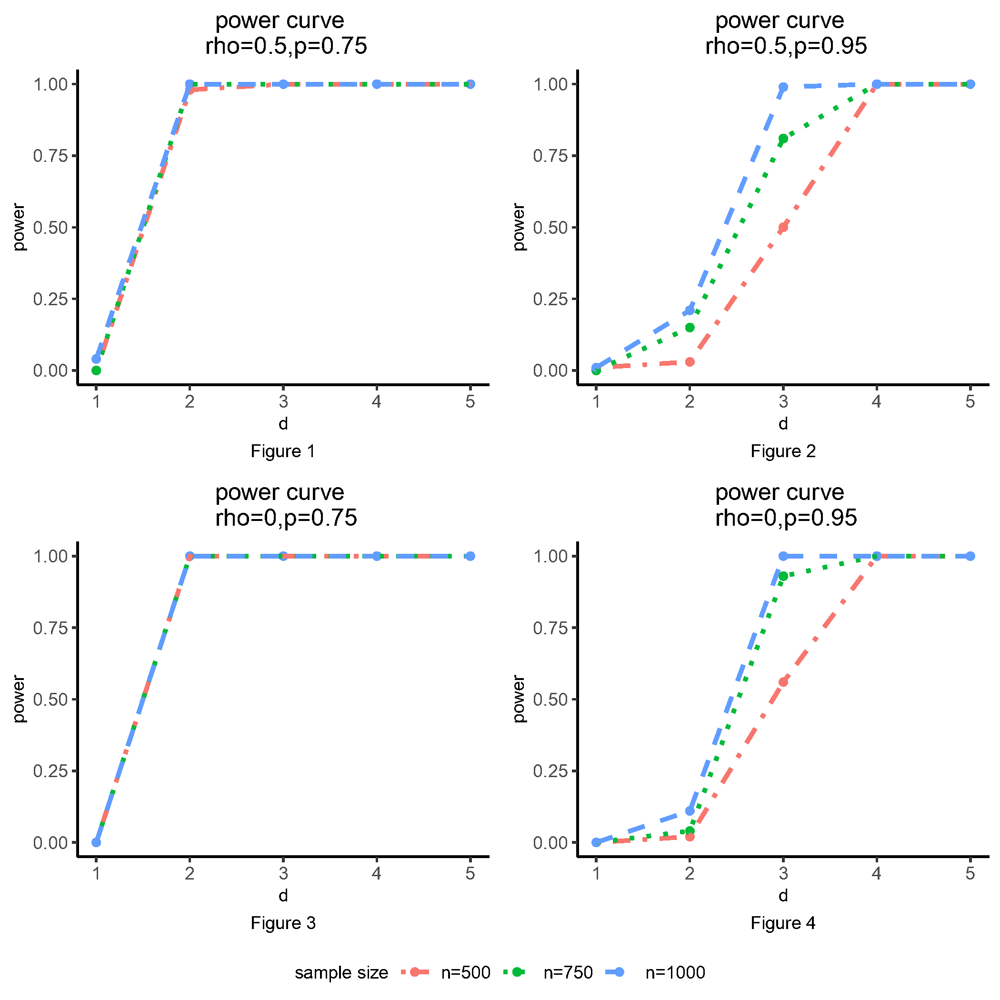

# \`bd.gwas.test\`: Fast Ball Divergence Test for Multiple Hypothesis Tests

## Introduction

The $K$-sample Ball Divergence (KBD) is a nonparametric method to test
the differences between $K$ probability distributions. It is specially
designed for metric-valued and imbalanced data, which is consistent with
the characteristics of the GWAS data. It is computationally intensive
for a large GWAS dataset because of the ultra-high dimensionality of the
data. Therefore, a fast KBD Test for GWAS data implemented in function
`bd.gwas.test` is developed and programmed to accelerate the
computational speed.

## Faster implementation: quick start

We use a synthetic data to demonstrate the usage of `bd.gwas.test`. In
this example, phenotype data are generated from three multivariate
normal distributions with the same dimension but heterogeneous mean and
covariance matrix. The three multivariate normal distributions are: (i).
$N \sim \left( \mu,\Sigma^{(1)} \right)$, (ii)
$N \sim \left( \mu + 0.1 \times d,\Sigma^{(2)} \right)$, and (iii)
$N \sim \left( \mu + 0.1 \times d,\Sigma^{(3)} \right)$. Here, the mean
$\mu$ is set to $\textbf{𝟎}$ and the covariance matrix covariance
matrices follow the auto-regressive structure with some perturbations:
$$\Sigma_{ij}^{(1)} = \rho^{|i - j|},\ \ \Sigma_{ij}^{(2)} = (\rho - 0.1 \times d)^{|i - j|},\ \ \Sigma_{ij}^{3} = (\rho + 0.1 \times d)^{|i - j|}.$$
The dimension of phenotype $k$ is fixed as 100.

``` r
library(mvtnorm)

num <- 100
snp_num <- 200
k <- 100
rho <- 0.5
freq0 <- 0.75
d <- 3

set.seed(2021)

ar1 <- function (p, rho = 0.5) 
{
    Sigma <- matrix(0, p, p)
    for (i in 1:p) {
        for (j in 1:p) {
            Sigma[i, j] <- rho^(abs(i - j))
        }
    }
    return(Sigma)
}

mean0 <- rep(0, k)
mean1 <- rep(0.1 * d, k)
mean2 <- rep(-0.1 * d, k)

cov0 <- ar1(p = k, rho = rho)
cov1 <- ar1(p = k, rho = rho - 0.1 * d)
cov2 <- ar1(p = k, rho = rho + 0.1 * d)

p1 <- freq0 ^ 2
p2 <- 2 * freq0 * (1 - freq0)
n1 <- round(num * p1)
n2 <- round(num * p2)
n3 <- num - n1 - n2
x0 <- rmvnorm(n1, mean = mean0, sigma = cov0)
x1 <- rmvnorm(n2, mean = mean1, sigma = cov1)
x2 <- rmvnorm(n3, mean = mean2, sigma = cov2)
x <- rbind(x0, x1, x2)
head(x[, 1:6])
```

    ##             [,1]       [,2]       [,3]       [,4]       [,5]       [,6]
    ## [1,]  0.07039579  0.6100092  0.5546911  0.5346480  0.5785020 -1.3470882
    ## [2,] -0.19620313  0.2196482 -0.2968494 -0.7916355 -1.3371275 -0.5766259
    ## [3,] -0.18575434 -1.4601779 -1.2635876 -0.8933793 -0.9336481 -0.5277624
    ## [4,]  1.56843201  1.6330457  1.8725853  0.8344465  0.5674250 -0.3928510
    ## [5,] -0.54939765  0.1602176  0.4325440 -0.1750343  0.5231533 -1.0931093
    ## [6,] -0.19665796 -1.3788672 -0.6887342 -1.2731113 -0.6638883  0.0764279

The number of SNPs is fixed as $200$ and the sample size is set to
$100$. The sample sizes of the three groups follow the transmission
ratio:
$$n_{1}:n_{2}:n_{3} \approx p^{2}:2pq:q^{2},\left( p + q = 1,n_{1} + n_{2} + n_{3} = 100 \right).$$
Here, $p$ is set to be $0.75$, representing a scenario that close to the
real data. $d$ is a user-specific positive integer, indicating the
differences between the three probability distributions. Here, we use
$d = 3$, aiming to show that the SNP which matched with the distribution
can be identified, even when the differences between distribution is
small.

``` r
effect_snp <- c(rep(0, n1), rep(1, n2),
                rep(2, n3))
noise_snp <- sapply(2:snp_num, function(j) {
  sample(
    0:2,
    size = num,
    replace = TRUE,
    prob = c(p1, p2, 1 - p1 - p2)
  )
})
snp <- cbind(effect_snp, noise_snp)
head(snp[, 1:6])
```

    ##      effect_snp          
    ## [1,]          0 1 0 0 0 0
    ## [2,]          0 1 1 1 0 0
    ## [3,]          0 0 0 1 0 0
    ## [4,]          0 0 1 0 2 0
    ## [5,]          0 1 1 0 0 0
    ## [6,]          0 1 1 1 1 0

Given the synthetic dataset `x` and `snp`, multiple KBD tests is
conducted by:

``` r
library(Ball)
res <- bd.gwas.test(x = x, snp = snp)
```

    ## =========== Pre-screening SNPs ===========
    ## Refining SNP... Progress: 1/1. 
    ## Refined p-value: 0.0000499975, cost time: 3 (s).

And we present the SNPs that is significant:

``` r
str(res)
```

    ## List of 8
    ##  $ statistic                 : num [1:200] 4.218 0.876 1.881 1.104 1.143 ...
    ##  $ permuted.statistic        :'data.frame':  20000 obs. of  1 variable:
    ##   ..$ g3: num [1:20000] 0.819 1.114 1.112 1.563 0.906 ...
    ##  $ eigenvalue                : NULL
    ##  $ p.value                   : num [1:200] 0.00005 0.9112 0.0577 0.60847 0.55267 ...
    ##  $ refined.snp               : int 1
    ##  $ refined.p.value           : num 5e-05
    ##  $ refined.permuted.statistic: num [1:20000, 1] 1.216 0.857 0.988 0.937 1.37 ...
    ##   ..- attr(*, "dimnames")=List of 2
    ##   .. ..$ : NULL
    ##   .. ..$ : chr "SNP1"
    ##  $ screening.result          :List of 5
    ##   ..$ : num [1:200] 4.218 0.876 1.881 1.104 1.143 ...
    ##   ..$ :'data.frame': 20000 obs. of  1 variable:
    ##   .. ..$ g3: num [1:20000] 0.819 1.114 1.112 1.563 0.906 ...
    ##   ..$ : num [1:200] 0.00005 0.9112 0.0577 0.60847 0.55267 ...
    ##   ..$ : int [1:10000] 0 97 44 35 95 99 39 19 46 65 ...
    ##   ..$ : int 0

## Why `bd.gwas.test` is faster?

Our faster implementation for multiple testing significantly speeds up
the KBD test in two aspects.

### Two-step algorithm

First, it uses a two-step algorithm for KBD. The algorithm first
computes an empirical $p$-value for each SNP using a modest number of
permutations which gives precise enough estimates of the $p$-values
above a threshold. Then, the SNPs with first stage $p$-values being less
than the threshold are moved to the second stage for a far greater
number of permutations.

### Recycle permutation result

Another key technique in `bd.test.gwas` is reusing the empirical KBD’s
distribution under the null hypothesis. This technique is particularly
helpful for decreasing computational burden when the number of factors
$p$ is very large and $K$ is a single digit. A typical case is the GWAS
study, in which $p \approx 10^{4}$ or $10^{5}$ but $K = 3$.

## Power evaluation

According to the simulations:

- the empirical type I errors of KBD are reasonably controlled around
  $10^{- 5}$;

- the power of KBD increases as either the sample size or the difference
  between means or covariance matrices increases. The empirical power is
  close to $1$ when the difference between distributions is large
  enough.

Furthermore, correlated responses may slightly decrease the power of the
test compared to the case of independent responses. Moreover, KBD
performs better when the data are not extremely imbalanced and it
maintains reasonable power for the imbalanced setting.

Compared to other methods, KBD performs better in most of the scenarios,
especially when the simulation setting is close to the real data.
Moreover, KBD is more computationally efficient in identifying
significant variants.

From Figures 1 and 3, we can notice that the power curves are similar
after sample size of 500, when the minor allele frequency is not small.
On the other hand, when the minor allele is rare, a larger sample size
can lead to a higher power from Figures 2 and 4. The four figures show
how sample size could affect the power of the KBD method, indicating
that there is an inverse relationship between minor allele frequency and
the sample sizes in order to get sufficient power.



## Conclusion

We implement `bd.test.gwas` in Ball package for handling multiple KBD
test. KBD is a powerful method that can detect the significant variants
with a controllable type I error regardless if the data are balanced or
not.

## Reference

Yue Hu, Haizhu Tan, Cai Li, Heping Zhang. (2021). Identifying genetic
risk variants associated with brain volumetric phenotypes via K-sample
Ball Divergence method. Genetic Epidemiology, 1–11.
<https://doi.org/10.1002/gepi.22423>
